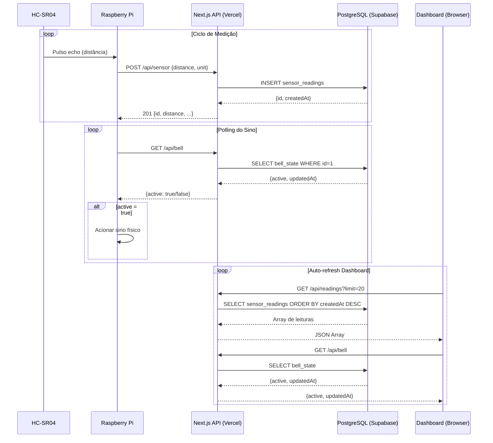

# Arquitetura do Sistema — Servidor IoT (Radar HC-SR04 + SG90)

> Documento técnico gerado com base na análise estática do código-fonte do repositório.
> Produzido em 2026-03-18. Destinado a suportar a redação do relatório académico universitário.

---

## Índice

1. [Visão Geral do Sistema](#1-visão-geral-do-sistema)
2. [Stack Tecnológica](#2-stack-tecnológica)
3. [Estrutura de Ficheiros e Módulos](#3-estrutura-de-ficheiros-e-módulos)
4. [Arquitetura da API](#4-arquitetura-da-api)
5. [Modelo de Dados](#5-modelo-de-dados)
6. [Fluxo de Dados em Tempo Real](#6-fluxo-de-dados-em-tempo-real)
7. [Autenticação e Segurança](#7-autenticação-e-segurança)
8. [Configuração e Variáveis de Ambiente](#8-configuração-e-variáveis-de-ambiente)
9. [Deploy e Infraestrutura](#9-deploy-e-infraestrutura)
10. [Integração com o Raspberry Pi](#10-integração-com-o-raspberry-pi)
11. [Sumário para Relatório Académico](#11-sumário-para-relatório-académico)

---

## 1. Visão Geral do Sistema

### Propósito

O servidor constitui o componente central de um sistema IoT de monitorização de distâncias baseado em radar. Funciona como intermediário entre o hardware físico (Raspberry Pi com sensor ultrassónico HC-SR04 e servo motor SG90) e o utilizador final, expondo uma API REST e um dashboard web em tempo real.

### Contexto do Projeto

| Componente | Função |
|---|---|
| **HC-SR04** | Sensor ultrassónico de distância, montado sobre o servo SG90 |
| **SG90** | Servo motor que rotaciona o HC-SR04 para criar um varrimento tipo radar |
| **Raspberry Pi** | Controla o hardware, lê as distâncias e publica dados via HTTP para este servidor |
| **Servidor Next.js** | Recebe, persiste e expõe os dados; serve o dashboard web |
| **Supabase (PostgreSQL)** | Base de dados remota que armazena permanentemente as leituras e o estado do sino |

### Clientes/Consumidores

| Cliente | Interface | Modo de uso |
|---|---|---|
| **Raspberry Pi (Python)** | API REST (`POST /api/sensor`, `GET /api/bell`) | Envia leituras, lê estado do sino |
| **Browser (Dashboard)** | Página React com polling (`GET /api/readings`, `GET /api/bell`) | Visualização humana em tempo real |

---

## 2. Stack Tecnológica

### Framework e Runtime

| Tecnologia | Versão | Papel |
|---|---|---|
| **Next.js** | `16.1.6` | Framework React fullstack com App Router; serve páginas e API routes |
| **React** | `19.2.3` | Biblioteca de UI |
| **TypeScript** | `^5` | Linguagem principal (tipagem estática) |
| **Node.js** | ≥ 18 (implícito pelo Next.js 16) | Runtime do servidor |

### Base de Dados e ORM

| Tecnologia | Versão | Papel |
|---|---|---|
| **PostgreSQL** | (gerido pela Supabase) | Base de dados relacional |
| **Supabase** | serviço externo | Hosting do PostgreSQL com suporte a connection pooling (pgBouncer) |
| **Prisma ORM** | `^7.5.0` | Mapeamento objeto-relacional; geração de cliente tipado |
| **@prisma/adapter-pg** | `^7.5.0` | Adaptador Prisma para o driver `pg` nativo |
| **pg** | `^8.20.0` | Driver PostgreSQL para Node.js |

### Interface de Utilizador

| Tecnologia | Versão | Papel |
|---|---|---|
| **Tailwind CSS** | `^4` | Estilos utilitários com espaço de cor OKLCH |
| **Radix UI** | `^1.x / ^2.x` (múltiplos pacotes) | Componentes acessíveis headless (diálogos, menus, etc.) |
| **Lucide React** | `^0.577.0` | Biblioteca de ícones SVG |
| **Recharts** | `^3.8.0` | Gráficos (disponível nas dependências, não em uso visível na página principal) |
| **next-themes** | `^0.4.6` | Suporte a tema claro/escuro |
| **Sonner** | `^2.0.7` | Notificações tipo toast |
| **React Hook Form** | `^7.71.2` | Gestão de formulários |
| **Embla Carousel** | `^8.6.0` | Carrossel de itens |
| **cmdk** | `^1.1.1` | Paleta de comandos |
| **tw-animate-css** | `^1.4.0` | Animações CSS via Tailwind |

### Observabilidade e Deploy

| Tecnologia | Versão | Papel |
|---|---|---|
| **@vercel/analytics** | `^2.0.0` | Análise de tráfego web (injeta script de telemetria) |
| **dotenv** | `^17.3.1` | Carregamento de variáveis de ambiente em desenvolvimento |

### Ferramentas de Desenvolvimento

| Tecnologia | Versão | Papel |
|---|---|---|
| **ESLint** | `^9` + `eslint-config-next` | Linting estático |
| **@tailwindcss/postcss** | `^4` | Processamento de CSS com PostCSS |

---

## 3. Estrutura de Ficheiros e Módulos

```
servidor/
│
├── app/                          # App Router do Next.js (páginas + rotas de API)
│   ├── api/                      # Rotas de API (Route Handlers)
│   │   ├── sensor/
│   │   │   └── route.ts          # POST /api/sensor — ingesta de leituras do Pi
│   │   ├── readings/
│   │   │   └── route.ts          # GET  /api/readings — consulta de leituras (dashboard)
│   │   └── bell/
│   │       └── route.ts          # GET/POST /api/bell — estado do sino
│   ├── globals.css               # CSS global: variáveis de tema OKLCH, animações
│   ├── layout.tsx                # Layout raiz: fonte Geist, metadata, Vercel Analytics
│   └── page.tsx                  # Dashboard principal (Client Component)
│
├── components/                   # Componentes React reutilizáveis
│   ├── radar-animation.tsx       # Animação radar em Canvas 2D
│   ├── readings-table.tsx        # Tabela de leituras com formatação por distância
│   ├── search-controls.tsx       # Controlos de pesquisa e auto-refresh
│   ├── stats-cards.tsx           # Cards de estatísticas (total, média, min, max)
│   ├── theme-provider.tsx        # Wrapper do next-themes
│   └── ui/                       # ~70 ficheiros — componentes Radix UI estilizados
│
├── lib/                          # Lógica de negócio partilhada (server-side)
│   ├── auth.ts                   # Validação de API key (x-api-key header)
│   ├── prisma.ts                 # Singleton do PrismaClient com adapter pg
│   └── utils.ts                  # Utilitários CSS: fn cn() (clsx + tailwind-merge)
│
├── prisma/
│   └── schema.prisma             # Esquema da base de dados (modelos e datasource)
│
├── generated/
│   └── prisma/                   # Cliente Prisma gerado automaticamente (não editar)
│
├── public/                       # Ficheiros estáticos (ícones, imagens)
│
├── .env                          # Variáveis de ambiente (DATABASE_URL, API_KEY)
├── .env.local                    # Variáveis locais (inclui NEXT_PUBLIC_API_KEY)
├── next.config.ts                # Configuração do Next.js (mínima)
├── postcss.config.mjs            # Configuração PostCSS (@tailwindcss/postcss)
├── tsconfig.json                 # Configuração TypeScript
├── eslint.config.mjs             # Configuração ESLint
└── package.json                  # Manifesto do projeto e dependências
```

### Responsabilidade dos Módulos Principais

| Módulo | Responsabilidade |
|---|---|
| `app/api/sensor/route.ts` | Ponto de entrada de dados do hardware. Valida API key, valida body, persiste leitura |
| `app/api/readings/route.ts` | Fornece dados históricos ao dashboard. Suporta paginação por `limit` |
| `app/api/bell/route.ts` | Gestão do estado do sino. `GET` lê o estado atual; `POST` faz toggle |
| `app/page.tsx` | Dashboard interativo: polling, visualização, auto-refresh |
| `lib/auth.ts` | Centraliza a lógica de autenticação por API key para todas as rotas |
| `lib/prisma.ts` | Garante que existe apenas uma instância do cliente Prisma (padrão singleton) |
| `prisma/schema.prisma` | Fonte de verdade do esquema da base de dados |

---

## 4. Arquitetura da API

Todos os endpoints residem sob `/api/` e são implementados como **Next.js Route Handlers** (App Router). Não existe middleware global de autenticação — a validação é feita manualmente em cada handler.

### Resumo dos Endpoints

| Método | Path | Autenticação | Produzido por | Consumido por |
|---|---|---|---|---|
| `POST` | `/api/sensor` | `x-api-key` (obrigatório) | Raspberry Pi | — |
| `GET` | `/api/readings` | `x-api-key` (obrigatório) | — | Dashboard (browser) |
| `GET` | `/api/bell` | `x-api-key` (obrigatório) | — | Raspberry Pi + Dashboard |
| `POST` | `/api/bell` | `x-api-key` (obrigatório) | Dashboard (browser) | — |

---

### `POST /api/sensor`

**Ficheiro:** `app/api/sensor/route.ts`

**Propósito:** Receber e persistir uma leitura de distância enviada pelo Raspberry Pi.

#### Request

```
Headers:
  x-api-key: <API_KEY>
  Content-Type: application/json

Body (JSON):
{
  "distance": number,   // obrigatório — valor em cm
  "unit":     string    // opcional — default "cm"
}
```

#### Response

| Código | Descrição | Body |
|---|---|---|
| `201 Created` | Leitura criada com sucesso | `{ id, distance, unit, createdAt }` |
| `400 Bad Request` | `distance` ausente ou não numérico | `{ "error": "Invalid body. 'distance' (number) is required." }` |
| `401 Unauthorized` | API key inválida ou ausente | `{ "error": "Unauthorized" }` |

#### Lógica de negócio

1. Valida header `x-api-key`
2. Faz parse do body JSON
3. Valida presença e tipo do campo `distance`
4. Persiste via `prisma.sensorReading.create()`
5. Retorna o registo criado com status `201`

---

### `GET /api/readings`

**Ficheiro:** `app/api/readings/route.ts`

**Propósito:** Devolver as leituras mais recentes para o dashboard.

#### Request

```
Headers:
  x-api-key: <API_KEY>

Query Parameters:
  limit  integer  opcional, default=50, máximo=500
```

#### Response

| Código | Descrição | Body |
|---|---|---|
| `200 OK` | Lista de leituras | `Array<{ id, distance, unit, createdAt }>` |
| `401 Unauthorized` | API key inválida | `{ "error": "Unauthorized" }` |

#### Lógica de negócio

1. Valida header `x-api-key`
2. Extrai e limita o parâmetro `limit` (`Math.min(limit, 500)`)
3. Consulta `prisma.sensorReading.findMany()` ordenado por `createdAt DESC`
4. Retorna array JSON

---

### `GET /api/bell`

**Ficheiro:** `app/api/bell/route.ts`

**Propósito:** Devolver o estado atual do sino. Cria o registo singleton se não existir.

#### Request

```
Headers:
  x-api-key: <API_KEY>
```

#### Response

| Código | Body |
|---|---|
| `200 OK` | `{ "active": boolean, "updatedAt": string }` |
| `401 Unauthorized` | `{ "error": "Unauthorized" }` |

#### Lógica de negócio

1. Valida header `x-api-key`
2. `prisma.bellState.upsert()` — cria o registo com `id=1` se não existir, caso contrário não altera
3. Retorna `{ active, updatedAt }`

---

### `POST /api/bell`

**Ficheiro:** `app/api/bell/route.ts`

**Propósito:** Fazer toggle do estado do sino (ligado ↔ desligado).

#### Request

```
Headers:
  x-api-key: <API_KEY>

Body: (vazio — nenhum parâmetro necessário)
```

#### Response

| Código | Body |
|---|---|
| `200 OK` | `{ "active": boolean, "updatedAt": string }` (novo estado) |
| `401 Unauthorized` | `{ "error": "Unauthorized" }` |

#### Lógica de negócio

1. Valida header `x-api-key`
2. `prisma.bellState.upsert()` — garante existência do registo singleton
3. `prisma.bellState.update()` — inverte o valor de `active`
4. Retorna o novo estado

---

### Middleware e Autenticação

Não existe middleware de arquivo (`middleware.ts`). A autenticação é aplicada de forma **procedural** em cada handler através de:

```typescript
// lib/auth.ts
export function validateApiKey(request: NextRequest): boolean {
  const apiKey = request.headers.get("x-api-key");
  return apiKey === process.env.API_KEY;
}
```

---

## 5. Modelo de Dados

### Diagrama Entidade-Relação (Conceptual)

```
┌─────────────────────────────────┐      ┌─────────────────────────────┐
│         sensor_readings         │      │          bell_state         │
├─────────────────────────────────┤      ├─────────────────────────────┤
│ id         INT  PK AUTOINCREMENT│      │ id         INT  PK (= 1)    │
│ distance   FLOAT    NOT NULL    │      │ active     BOOLEAN DEFAULT F │
│ unit       VARCHAR  DEFAULT 'cm'│      │ updatedAt  TIMESTAMP AUTO    │
│ createdAt  TIMESTAMP DEFAULT NOW│      └─────────────────────────────┘
└─────────────────────────────────┘
        (sem relação entre tabelas)
```

### Modelo `SensorReading`

Mapeia para a tabela `sensor_readings`.

| Campo | Tipo Prisma | Tipo PostgreSQL | Restrições | Descrição |
|---|---|---|---|---|
| `id` | `Int` | `SERIAL` | PK, Auto-increment | Identificador único |
| `distance` | `Float` | `DOUBLE PRECISION` | NOT NULL | Distância medida em cm (ou outra unidade) |
| `unit` | `String` | `VARCHAR` | Default `"cm"` | Unidade da medição |
| `createdAt` | `DateTime` | `TIMESTAMPTZ` | Default `now()` | Timestamp da leitura |

### Modelo `BellState`

Mapeia para a tabela `bell_state`. Implementa o **padrão Singleton** — existe sempre exatamente um registo com `id = 1`.

| Campo | Tipo Prisma | Tipo PostgreSQL | Restrições | Descrição |
|---|---|---|---|---|
| `id` | `Int` | `INT` | PK, fixo em `1` | Identificador do singleton |
| `active` | `Boolean` | `BOOLEAN` | Default `false` | Estado atual do sino |
| `updatedAt` | `DateTime` | `TIMESTAMPTZ` | `@updatedAt` auto | Última atualização |

### Tipos TypeScript Utilizados no Cliente

```typescript
// Usado em app/page.tsx e componentes do dashboard
interface Reading {
  id: number
  distance: number
  unit: string
  createdAt: string   // ISO 8601 string
}
```

---

## 6. Fluxo de Dados em Tempo Real

### Mecanismo Utilizado: Polling HTTP

O sistema **não utiliza** Server-Sent Events (SSE) nem WebSockets. A comunicação em tempo real é implementada através de **polling periódico** no cliente (browser).

### Fluxo do Dashboard

```
Browser (page.tsx)
  │
  ├─ [Montagem inicial]
  │    └──► GET /api/readings?limit=N  (x-api-key)
  │    └──► GET /api/bell              (x-api-key)
  │
  ├─ [Auto-refresh LIGADO]
  │    └──► setInterval(fetchAll, intervalMs)
  │              └──► GET /api/readings  (em paralelo com Promise.all)
  │              └──► GET /api/bell
  │
  └─ [Auto-refresh DESLIGADO]
       └──► Botão "Pesquisar" → fetchAll() manual
```

### Parâmetros do Polling

| Parâmetro | Controlo | Valor padrão | Mínimo |
|---|---|---|---|
| Intervalo (ms) | Input numérico no dashboard | `2000 ms` | `100 ms` |
| Ligado/Desligado | Botão toggle "Ligar/Desligar" | Desligado | — |

### Fluxo do Raspberry Pi

```
Raspberry Pi (Python)
  │
  ├─ [Loop de medição]
  │    └──► HC-SR04 mede distância
  │    └──► POST /api/sensor  { distance, unit }  (x-api-key)
  │
  └─ [Loop de polling do sino]
       └──► GET /api/bell  (x-api-key)
            └──► Se active=true → acionar alarme/sino físico
```

> **Nota:** A frequência com que o Raspberry Pi faz polling do `/api/bell` é definida no código Python (não presente neste repositório).

---

## 7. Autenticação e Segurança

### Mecanismo de Autenticação

O sistema utiliza **API Key estática** transmitida no header HTTP `x-api-key`.

```
Header: x-api-key: <valor definido em API_KEY>
```

| Aspeto | Detalhe |
|---|---|
| Tipo | Static API Key |
| Localização | HTTP Header `x-api-key` |
| Armazenamento no servidor | Variável de ambiente `API_KEY` (server-side) |
| Exposição ao browser | `NEXT_PUBLIC_API_KEY` (client-side, visível no bundle JS) |
| Âmbito | Todos os endpoints `/api/*` |

> **Aviso de segurança:** A chave `NEXT_PUBLIC_API_KEY` é exposta no bundle JavaScript enviado ao browser. Qualquer utilizador que inspecione o source pode obtê-la. Para um sistema de produção, recomenda-se que as chamadas de leitura do dashboard passem por um servidor intermediário sem expor a chave.

### Validação de Inputs

| Endpoint | Validação |
|---|---|
| `POST /api/sensor` | Verifica se `distance` existe e é do tipo `number`; rejeita com `400` |
| `GET /api/readings` | O parâmetro `limit` é coercido para número e limitado a `500` com `Math.min` |
| `GET /api/bell` | Sem body — sem validação necessária |
| `POST /api/bell` | Sem body — sem validação necessária |

### CORS

Não existe configuração explícita de CORS no projeto. O Next.js **não adiciona headers CORS por defeito** para as API routes. As chamadas de leitura do dashboard são same-origin (browser → mesmo domínio). O Raspberry Pi chama a API externamente, o que pode ser bloqueado se o servidor estiver atrás de uma CDN com CORS restritivo.

### Rate Limiting

**Não existe** rate limiting implementado. Não há middleware de throttling, `express-rate-limit`, ou configuração de rate limiting na Vercel.

### HTTPS

Assumido pelo hosting na Vercel (todos os deployments têm TLS/HTTPS por defeito).

---

## 8. Configuração e Variáveis de Ambiente

### Ficheiros de Configuração

| Ficheiro | Âmbito | Descrição |
|---|---|---|
| `.env` | Build + Runtime | Variáveis base do projeto |
| `.env.local` | Desenvolvimento local | Sobrescreve `.env`; inclui `NEXT_PUBLIC_*` |

### Variáveis de Ambiente

| Variável | Visibilidade | Obrigatória | Função |
|---|---|---|---|
| `DATABASE_URL` | Server-side only | Sim | URL de ligação ao PostgreSQL via **pgBouncer** (connection pooling). Usada pelo PrismaClient em runtime. |
| `DIRECT_URL` | Server-side only | Sim (para migrações) | URL de ligação direta ao PostgreSQL (sem pooling). Usada pelo `prisma migrate`. |
| `API_KEY` | Server-side only | Sim | Chave secreta para autenticar todos os pedidos à API. Comparada com o header `x-api-key`. |
| `NEXT_PUBLIC_API_KEY` | **Client-side (público)** | Sim (para dashboard) | Mesma chave, exposta ao browser para que o dashboard possa fazer fetch das APIs. |

### Configuração Next.js (`next.config.ts`)

O ficheiro está presente mas vazio (sem configurações personalizadas):

```typescript
const nextConfig: NextConfig = {
  /* config options here */
};
```

### Configuração Tailwind/PostCSS

Tailwind CSS v4 com plugin PostCSS (`@tailwindcss/postcss`). Sem ficheiro `tailwind.config.js` separado — a configuração de tema é feita inteiramente em `globals.css` via diretiva `@theme inline`.

---

## 9. Deploy e Infraestrutura

### Plataforma de Deploy

O projeto está configurado para deploy na **Vercel**, evidenciado por:

- Dependência `@vercel/analytics` (integra automaticamente com o Vercel Analytics)
- Script `build`: `prisma generate && next build` (compatível com Vercel Build Command)
- Uso de variáveis de ambiente no formato Vercel (`.env`, `.env.local`)

### Cadeia de Build

```
1. prisma generate   → Gera o cliente Prisma tipado em /generated/prisma/
2. next build        → Compila TypeScript, bundla assets, otimiza páginas
3. next start        → Inicia servidor de produção
```

### Infraestrutura de Base de Dados

| Componente | Serviço | Detalhe |
|---|---|---|
| PostgreSQL hosting | **Supabase** | Região: `aws-1-eu-west-1` (Europa Ocidental) |
| Connection pooling | **pgBouncer** (via Supabase) | Porta 6543 — para o Prisma Client em runtime |
| Ligação direta | PostgreSQL nativo | Porta 5432 — para migrações Prisma |

### CI/CD

**Não existe** ficheiro de CI/CD no repositório (`.github/workflows/`, `gitlab-ci.yml`, etc.). O deploy é gerido pelo Vercel via integração Git (auto-deploy em push para a branch principal).

### Diagrama de Infraestrutura

```
┌─────────────┐    HTTPS     ┌───────────────────────────────────┐
│ Raspberry   │─────────────►│           Vercel Edge             │
│ Pi (Python) │              │  ┌────────────────────────────┐   │
└─────────────┘              │  │    Next.js (App Router)    │   │
                             │  │                            │   │
┌─────────────┐    HTTPS     │  │  /api/sensor (POST)        │   │
│   Browser   │─────────────►│  │  /api/readings (GET)       │   │
│ (Dashboard) │◄─────────────│  │  /api/bell (GET/POST)      │   │
└─────────────┘    HTML/JSON │  └────────────┬───────────────┘   │
                             └───────────────┼───────────────────┘
                                             │ Prisma ORM
                                             │ (pgBouncer :6543)
                                             ▼
                             ┌───────────────────────────────────┐
                             │     Supabase (PostgreSQL)         │
                             │     aws-1-eu-west-1               │
                             │                                   │
                             │  ┌────────────────────────────┐   │
                             │  │     sensor_readings        │   │
                             │  │     bell_state             │   │
                             │  └────────────────────────────┘   │
                             └───────────────────────────────────┘
```

---

## 10. Integração com o Raspberry Pi

### Endpoints Usados pelo Pi

O Raspberry Pi (cliente Python) interage com **dois endpoints**:

#### 1. Enviar leitura de distância → `POST /api/sensor`

```python
# Exemplo equivalente Python
import requests

headers = {"x-api-key": "iot2026-...", "Content-Type": "application/json"}
payload = {"distance": 34.7, "unit": "cm"}

response = requests.post("https://<dominio>/api/sensor", json=payload, headers=headers)
# Resposta esperada: 201 Created
# { "id": 42, "distance": 34.7, "unit": "cm", "createdAt": "2026-03-18T..." }
```

#### 2. Verificar estado do sino → `GET /api/bell`

```python
# Exemplo equivalente Python
response = requests.get("https://<dominio>/api/bell", headers={"x-api-key": "iot2026-..."})
data = response.json()
# { "active": true, "updatedAt": "2026-03-18T..." }

if data["active"]:
    # Acionar sino/alarme físico
    pass
```

### Fluxo de Integração (Diagrama de Sequência)

```
HC-SR04          Raspberry Pi          Servidor Next.js       Supabase DB
   │                   │                      │                     │
   │──pulso trigger──► │                      │                     │
   │◄──echo pulse──── │                      │                     │
   │                   │                      │                     │
   │              calcula distance             │                     │
   │                   │                      │                     │
   │                   │──POST /api/sensor───►│                     │
   │                   │   {distance, unit}   │──INSERT ───────────►│
   │                   │                      │◄──{id, createdAt}── │
   │                   │◄──201 {id,...} ──────│                     │
   │                   │                      │                     │
   │                   │──GET /api/bell ──────►│                     │
   │                   │                      │──SELECT bell_state──►│
   │                   │                      │◄──{active, updatedAt}│
   │                   │◄──{active:true}──────│                     │
   │                   │                      │                     │
   │             aciona sino físico            │                     │
```

### Protocolo de Comunicação

| Atributo | Valor |
|---|---|
| Protocolo | HTTPS (REST) |
| Formato | JSON |
| Autenticação | Header `x-api-key` |
| Sentido do controlo (sino) | Pull-based: Pi faz polling do `/api/bell` |
| Sentido dos dados (leituras) | Push: Pi publica em `/api/sensor` |

---

## 11. Sumário para Relatório Académico

### 11.1 Capítulo: Arquitetura do Sistema

**Padrão arquitetural:** Arquitetura cliente-servidor em três camadas:

```
Camada de Apresentação  →  Dashboard React (Browser)
Camada de Lógica        →  Next.js API Routes (Vercel)
Camada de Dados         →  PostgreSQL (Supabase)
```

**Padrões de design identificados:**
- **Singleton** — instância única do PrismaClient (`lib/prisma.ts`) e registo único de `BellState` (`id=1`)
- **Repository Pattern** (implícito via Prisma) — separação entre lógica de negócio e acesso a dados
- **Polling** — mecanismo de tempo real do dashboard

**Características de qualidade:**
- Stateless API (cada pedido é autónomo)
- Base de dados gerida externamente (sem estado local no servidor)
- Deploy serverless (Vercel Functions)

---

### 11.2 Capítulo: Tecnologias Utilizadas

| Categoria | Tecnologia | Justificação de Escolha |
|---|---|---|
| Framework web | Next.js 16 | Fullstack React com App Router; suporte nativo a API routes e SSR |
| Base de dados | PostgreSQL via Supabase | Relacional, gerido, com connection pooling integrado |
| ORM | Prisma 7 | Type-safe, migrações declarativas, suporte a adapters |
| UI | Tailwind CSS 4 + Radix UI | Design system acessível e altamente customizável |
| Deploy | Vercel | Integração nativa com Next.js, edge network global |
| Autenticação | API Key estática | Simples para um sistema IoT sem utilizadores humanos na API |

---

### 11.3 Capítulo: Implementação

#### Componentes Implementados

| Componente | Ficheiro | Descrição |
|---|---|---|
| Ingesta de dados | `app/api/sensor/route.ts` | Recebe e valida leituras do HC-SR04 |
| Consulta de dados | `app/api/readings/route.ts` | Serve histórico paginado ao dashboard |
| Controlo do sino | `app/api/bell/route.ts` | Toggle e consulta do estado do sino |
| Dashboard | `app/page.tsx` | Interface web com polling, stats e tabela |
| Animação radar | `components/radar-animation.tsx` | Canvas 2D com varrimento animado |
| Autenticação | `lib/auth.ts` | Validação centralizada de API key |
| Acesso DB | `lib/prisma.ts` | Singleton do cliente Prisma com adapter pg |

#### Decisões de Implementação Notáveis

1. **`prisma.bellState.upsert()`** — garante que o registo singleton existe antes de qualquer leitura ou escrita, tornando a API idempotente na inicialização.
2. **`Math.min(limit, 500)`** — limitação defensiva do parâmetro `limit` para evitar queries que devolvam demasiados registos.
3. **`Promise.all([fetchReadings(), fetchBell()])`** — as duas chamadas de polling são paralelas, reduzindo a latência percetível.
4. **Cores OKLCH** — paleta de tema definida no espaço de cor perceptualmente uniforme OKLCH, produzindo transições de cor mais naturais.

---

### 11.4 Capítulo: Modelo de Dados

#### Entidades

| Entidade | Tabela | Tipo | Descrição |
|---|---|---|---|
| `SensorReading` | `sensor_readings` | Série temporal | Registo de cada medição de distância |
| `BellState` | `bell_state` | Singleton | Estado ligado/desligado do sino |

#### Esquema Completo

```sql
-- Leituras do sensor HC-SR04
CREATE TABLE sensor_readings (
  id         SERIAL PRIMARY KEY,
  distance   DOUBLE PRECISION NOT NULL,
  unit       VARCHAR NOT NULL DEFAULT 'cm',
  created_at TIMESTAMPTZ NOT NULL DEFAULT now()
);

-- Estado do sino (singleton, id sempre = 1)
CREATE TABLE bell_state (
  id         INTEGER PRIMARY KEY DEFAULT 1,
  active     BOOLEAN NOT NULL DEFAULT false,
  updated_at TIMESTAMPTZ NOT NULL
);
```

---

### 11.5 Diagramas Sugeridos para o Relatório

| Diagrama | Ferramenta sugerida | Conteúdo |
|---|---|---|
| **Diagrama de Componentes** | draw.io / PlantUML | Raspberry Pi ↔ Next.js API ↔ Supabase ↔ Browser |
| **Diagrama de Sequência** | PlantUML / Mermaid | Ciclo completo: medição → POST → DB → GET → dashboard |
| **Modelo Entidade-Relação** | draw.io / dbdiagram.io | Tabelas `sensor_readings` e `bell_state` |
| **Diagrama de Implementação** | draw.io | Vercel (serverless functions) + Supabase (Europa) |
| **Diagrama de Fluxo de Dados** | Lucidchart / draw.io | HC-SR04 → Pi → HTTPS → API → PostgreSQL → Browser |

#### Exemplo de Diagrama de Sequência (Mermaid)



---

*Documento gerado automaticamente por análise estática do código-fonte em 2026-03-18.*
*Repositório: `servidor/` — Branch: `main`*
